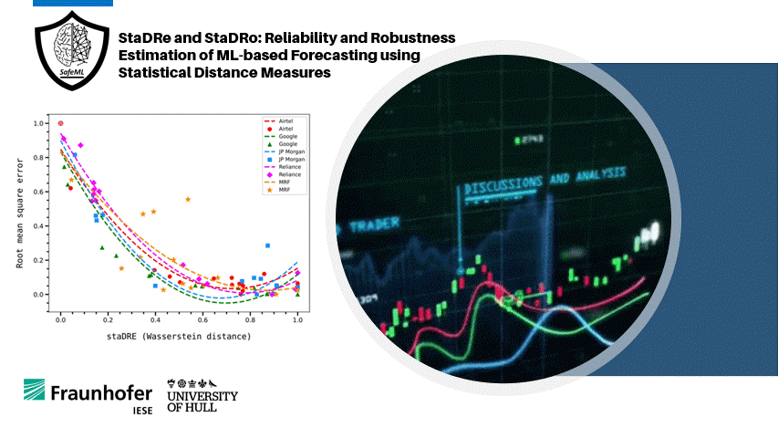

[](https://opensource.org/licenses/MIT) [](https://arxiv.org/abs/2206.11116
)
# StaDRe and StaDRo: Reliability and Robustness using Statistical Distance Dissimilarity
This project aims towards obtaining reliability and robustness estimate for a machine learning (ML) component. In particular, we focus on time series application. The repository contains the recent work, function and results. Further, Jupyter notebooks exemplifying the work are also provided. 

<figure>
    <center>
        
        <figcaption>The statistical distance dissimilarity is used to estimate reliability and robustness</figcaption>
    </center>
</figure>

The methodology is demonstrated on the following applications:
* Stock price prediction (Uni-variate time series)
* Machine failure prediction (multi-variate time series) [In progress]

## Getting started
To get started, simply create and activate the Anaconda environment with a name "stock" from the environment yml file provided.
```
conda env create -f env.yml
conda activate stock
```
The details examples can be found in the respective folders in ```UnivariateTimeSeries```.

## Contributors
* [Akshatha Ambekar](https://github.com/Akshatha2505) ([Fraunhofer Institute for Experimental Software Engineering](https://www.iese.fraunhofer.de/))
* [Mohammed Naveed Akram](https://github.com/n-akram) ([Fraunhofer Institute for Experimental Software Engineering](https://www.iese.fraunhofer.de/)) - naveed.akram@iese.fraunhofer.de
* [Ioannis Sorokos](https://github.com/ISorokos) ([Fraunhofer Institute for Experimental Software Engineering](https://www.iese.fraunhofer.de/)) - ioannis.sorokos@iese.fraunhofer.de
* [Koorosh Aslansefat](https://github.com/koo-ec) ([University of Hull](https://www.hull.ac.uk/)) - k.aslansefat-2018@hull.ac.uk

## Publication
Akram, M. N., Ambekar, A., [Sorokos, I.](https://scholar.google.com/citations?user=a_BdLPAAAAAJ&hl=en), [Aslansefat, K.](https://scholar.google.com/citations?user=YBa4Tl8AAAAJ&hl=en), & [Schneider, D.](https://scholar.google.com/citations?hl=en&user=GPEl_r8AAAAJ) StaDRe and StaDRo: Reliability and Robustness Estimation of ML-based Forecasting using Statistical Distance Measures.In International Conference on Computer Safety, Reliability, and Security SAFECOMP 2022. [[Pre-print PDF](https://arxiv.org/abs/2206.11116v1)]

## Cite as (To be published in SAFECOMP 2022)
```
@inproceedings{Akram2022Stadre,
   author  = {{Akram}, Mohammed Naveed and {Ambekar}, Akshatha and
            {Sorokos}, Ioannis and {Aslansefat}, Koorosh and 
            {Schneider}, Daniel},
   title   = "{StaDRe and StaDRo: Reliability and Robustness 
            Estimation of ML-based Forecasting using Statistical 
            Distance Measures}",
   booktitle = {International Conference on Computer Safety
                Reliability, and Security},
   year    = {2022},
   pages     = {-},
   organization  = {Springer},
}
```


## Acknowledgements
This work was partly supported by the Building Trust in Ecosystems and Ecosystem Component (BIECO) Horizon 2020 Project under Grant Agreement 952702.

## License
This framework is available under the MIT License.
